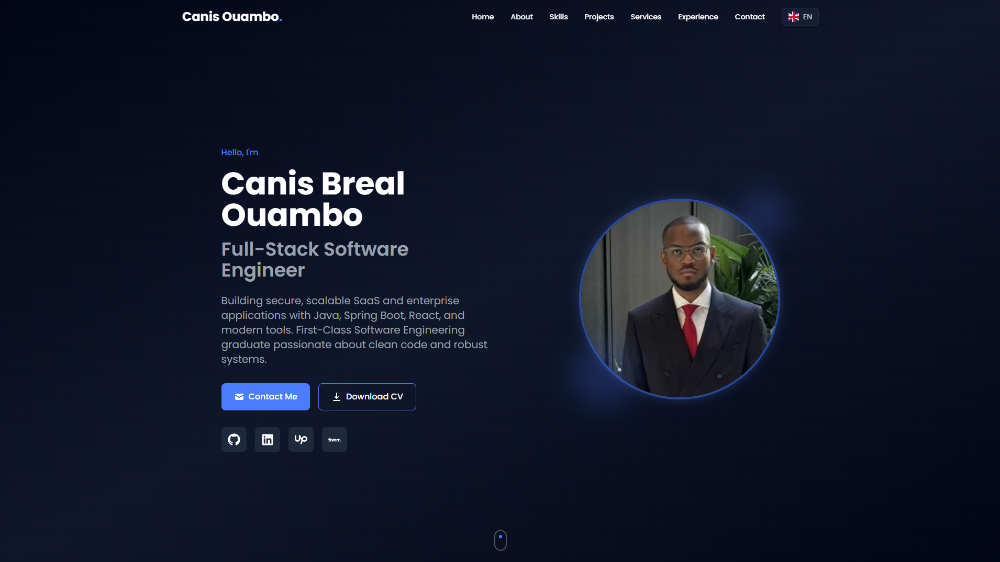

# Canis Ouambo | Full-Stack Software Engineer Portfolio

[](https://www.canisouambo.tech/)
[](https://www.linkedin.com/in/canis-breal-ouambo/)

A modern, responsive portfolio website showcasing my projects and skills as a Full-Stack Software Engineer.



## About Me

I'm a **First-Class Software Engineering graduate** from Manchester Metropolitan University with a passion for building secure, scalable applications. My experience spans full-stack development using **Java, Spring Boot, React**, and modern cloud technologies.

I enjoy solving complex problems and turning ideas into robust, production-ready systems. From multi-tenant SaaS platforms to real-time social applications, I focus on **clean code, performance, and delivering real value** to users and businesses.

## 🛠️ Tech Stack

### Languages


### Frontend


### Backend


### Databases


### Cloud & DevOps


## Featured Projects

### [WengHR](https://weng-hr.vercel.app/)

Multi-tenant HR Management System with employee management, customizable leave policies, and shift scheduling.

- **Highlights:** 4-tier RBAC, JWT authentication, i18n support
- **Impact:** Beta tested with 100+ users across multiple organizations
- **Tech:** Java, Spring Boot, React Native, MySQL, Docker

### [Chirrup](https://chirrup-social-media.vercel.app/)

Full-stack social media platform with user profiles, posts, and likes.

- **Highlights:** Optimized backend queries reducing feed loading time by 40%
- **Impact:** Supporting 200+ active users
- **Tech:** Node.js, Express.js, Vue.js, SQLite, Tailwind CSS

### [LM Global Solutions](https://www.lmglobals.com/)

Professional business website for an import/export client.

- **Highlights:** Bilingual support (French/English), responsive design
- **Impact:** Delivered same-day turnaround
- **Tech:** React, Tailwind CSS, Vite, Vercel

## Portfolio Features

- **Internationalization** - Available in English, French, and Spanish
- **Fully Responsive** - Optimized for all devices
- **Modern UI** - Smooth animations with Framer Motion
- **Fast Performance** - Built with Vite for optimal loading speeds
- **SEO Optimized** - Structured for search engine visibility

## Running Locally

```bash
# Clone the repository
git clone https://github.com/OuamboC/portfolio.git

# Navigate to the project
cd portfolio

# Install dependencies
npm install

# Start development server
npm run dev
```

## Get in Touch

I'm always open to discussing new opportunities, collaborations, or just having a chat about technology!

- **Portfolio:** [canisouambo.tech](https://www.canisouambo.tech/)
- **LinkedIn:** [linkedin.com/in/canis-ouambo](https://www.linkedin.com/in/canis-breal-ouambo/)
- **GitHub:** [github.com/OuamboC](https://github.com/OuamboC)

---

If you found this portfolio interesting, feel free to star the repo!
